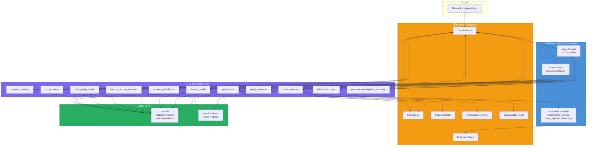
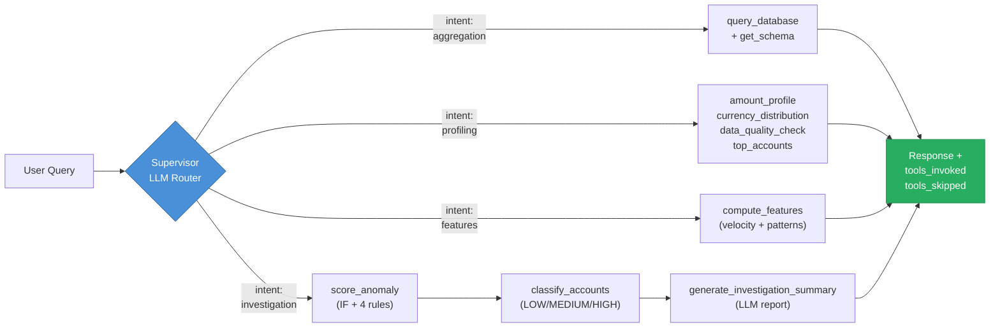
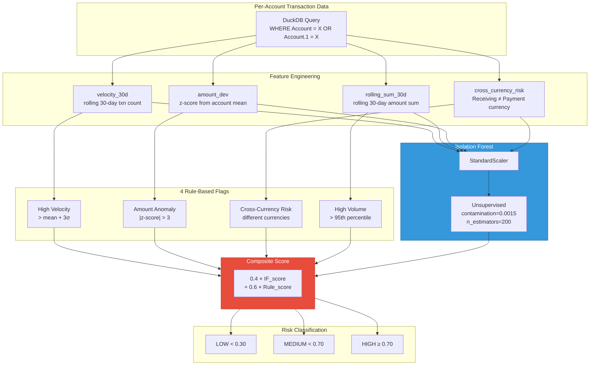
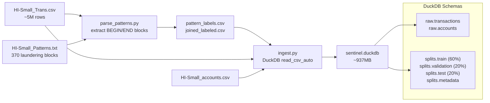

# Sentinel — AI-Powered Anti-Money Laundering Detection

---

## Table of Contents

1. [What Problem Does This Solve?](#what-problem-does-this-solve)
2. [How It Works](#how-it-works)
3. [Architecture](#architecture)
4. [Data Pipeline](#data-pipeline)
5. [The Supervisor — Dynamic Routing](#the-supervisor--dynamic-routing)
6. [Agents & Tools](#agents--tools)
7. [ML Pipeline](#ml-pipeline)
8. [Frontend](#frontend)
9. [Setup](#setup)
10. [Usage](#usage)
11. [Testing](#testing)
12. [Demo Queries](#demo-queries)
13. [Project Structure](#project-structure)
14. [External Tools & Libraries](#external-tools--libraries)

---

## What Problem Does This Solve?

Anti-Money Laundering (AML) investigation is fundamentally a needle-in-a-haystack problem. The IBM HI-Small dataset contains **5 million transactions** across **518,000 accounts**, but only **5,177 rows** (0.1%) represent laundering activity. A human analyst cannot manually review this volume.

**Sentinel** is an AI-powered investigation assistant that:

- Accepts **natural-language queries** from compliance officers
- **Dynamically routes** each query to the right analysis tool(s)
- **Scores accounts** using an explainable hybrid ML model
- **Generates plain-English investigation reports**
- **Visualizes** transaction networks, timelines, and risk levels

The key differentiator is **dynamic routing** — the system doesn't run every tool for every query. It parses intent, builds an execution plan, invokes only necessary tools, and transparently reports what was skipped.


---

## How It Works

```txt
User types a question → Supervisor parses intent → Selects tools → Tools query DuckDB / run ML → Results rendered as prose + interactive panels
```

1. **You ask a question** — e.g., "Investigate Account 8000EBD30 for money laundering"
2. **The supervisor** (an LLM agent) parses your intent and constructs an execution plan
3. **Only relevant tools run** — for an investigation: `score_anomaly` → `classify_accounts` → `generate_investigation_summary`
4. **Results come back** as structured metadata + plain-English prose + interactive visualizations (network graph, timeline, risk gauge)

---

## Architecture

### High-Level Data Flow



### Dynamic Routing Decision Flow



### ML Scoring Pipeline



---

## Data Pipeline

### Dataset

**Source:** [IBM Transactions for Anti-Money Laundering (AML)](https://www.kaggle.com/datasets/ealtman2019/ibm-transactions-for-anti-money-laundering-aml) (`ealtman2019`)

| Property | Value |
| --- | --- |
| Total transactions | 5,078,346 |
| Accounts | 518,582 |
| Laundering rows | 5,177 (0.1%) |
| Labeled laundering | ~3,577 (from Patterns.txt) |
| Unlabeled positives | ~1,600 (IF validation) |
| Columns | Timestamp, From Bank, Account, To Bank, Account.1, Amount Received, Receiving Currency, Amount Paid, Payment Currency, Payment Format, Is Laundering |
| Pattern types | FAN-OUT, FAN-IN, CYCLE, STACK, SCATTER-GATHER, GATHER-SCATTER, BIPARTITE, RANDOM, UNLABELED |

### Ingestion



**Key design decisions:**

- **Streaming ingestion** — DuckDB `read_csv_auto` streams the CSV; 5M rows never load into Pandas at once
- **Chronological splits** — 60/20/20 by timestamp ordering, preserving temporal integrity
- **Pattern labels joined at ingestion** — laundering typologies from Patterns.txt are joined onto every transaction row via a 5-field key

---

## The Supervisor — Dynamic Routing

The supervisor (`src/supervisor.py`) is the system's brain. It's a LangChain `create_agent` with 11 `@tool`-wrapped subagent functions, bound to Azure OpenAI GPT-5.4-mini.

### What It Does

1. Receives a natural-language query from the UI
2. The LLM parses intent, identifies entities/accounts, and constructs an execution plan
3. Calls only the tools needed — skipping everything else
4. Returns structured metadata: `intent`, `execution_plan`, `tools_invoked`, `tools_skipped`, `reasoning`, `results`

### Why `tools_invoked` Is Trustworthy

Most LLM-based routing systems trust the model to report which tools it used. This is fragile — the LLM can hallucinate or omit tool names.

**Sentinel derives `tools_invoked` from actual `ToolMessage` history** in the LangGraph message stream. The `tools_skipped` list is computed as the exact set difference: `ALL_TOOL_NAMES − tools_invoked`. This guarantees:

- `tools_invoked` ∩ `tools_skipped` = ∅ (no overlap)
- `tools_invoked` ∪ `tools_skipped` = ALL_TOOL_NAMES (complete coverage)
- The LLM cannot hallucinate an inconsistent skip list

### Multi-Turn Memory

The supervisor uses LangGraph's `MemorySaver` checkpointer, keyed by `thread_id`. This enables multi-turn conversations:

```txt
Turn 1: "Investigate Account 8000EBD30"           → full investigation
Turn 2: "Now show me its top receivers"            → context preserved
Turn 3: "Generate a formal summary for that account" → full context from both prior turns
```

---

## Agents & Tools

### Tool Registry (11 tools across 6 modules)

| Tool | Module | Purpose |
| --- | --- | --- |
| `query_database` | `data_query.py` | Read-only DuckDB SQL execution with validation |
| `get_schema` | `data_query.py` | Inspect DuckDB table/column structure |
| `amount_profile` | `eda.py` | Per-currency min/max/mean/median/stddev of transaction amounts |
| `currency_distribution` | `eda.py` | Counts and percentages per currency column |
| `data_quality_check` | `eda.py` | Null value counts across all columns |
| `top_accounts` | `eda.py` | Most active sender/receiver accounts by volume |
| `compute_features` | `features.py` | Velocity, rolling sums, amount deviation, AML pattern detection via networkx |
| `score_anomaly` | `anomaly.py` | Per-account hybrid IF + rule-based scoring |
| `batch_scan_top_accounts` | `anomaly.py` | Ranked suspicious account shortlist (top-N by volume) |
| `classify_accounts` | `risk.py` | Map composite scores to LOW/MEDIUM/HIGH risk tiers |
| `generate_investigation_summary` | `explain.py` | LLM-generated plain-English AML investigation report |

### Data Query (`src/agents/data_query.py`)

Provides safe, read-only SQL execution:

- Strips SQL comments before validation
- Enforces single SELECT/WITH statement (rejects semicolons, DML/DDL)
- Wraps results in `SELECT * FROM (...) LIMIT 100` for safety
- Returns formatted pipe-delimited text tables

### EDA (`src/agents/eda.py`)

Four profiling tools for understanding the dataset:

- **amount_profile** — per-currency statistics with explicit "no FX normalization" warning (amounts are in native currency units)
- **currency_distribution** — percentage breakdown by Payment or Receiving Currency
- **data_quality_check** — null counts for all 11 columns
- **top_accounts** — most active accounts by transaction count and native-currency total

### Features (`src/agents/features.py`)

Computes transaction-level features and detects AML graph patterns:

**Standard features (all rows):**

| Feature | Description |
| --- | --- |
| `velocity_30d` | Transaction count in the past 30 calendar days (per account, time-indexed) |
| `rolling_sum_30d` | Sum of Amount Paid in the past 30 days |
| `amount_dev` | Z-score deviation of Amount Paid from the account's mean |
| `cross_currency_risk` | Binary flag: Receiving Currency ≠ Payment Currency |

**AML pattern detection (via networkx on directed subgraphs):**

| Pattern | Detection Method |
| --- | --- |
| FAN-OUT | One account sends to ≥5 unique receivers |
| FAN-IN | One account receives from ≥5 unique senders |
| CYCLE | Directed cycle of length ≥3 |
| STACK | Repeated relay through the same receiver |
| SCATTER-GATHER | Hub with ≥5 in-degree AND ≥5 out-degree |
| GATHER-SCATTER | High in-degree hub whose out-neighbors also fan out |
| BIPARTITE | Graph is bipartite (two disjoint sets, cross-set edges only) |

**Shared computation:** `add_time_based_features()` is imported by both `features.py` and `anomaly.py`, ensuring the same rolling-window logic is used for feature reports and ML scoring.

### Anomaly (`src/agents/anomaly.py`)

Hybrid anomaly detection combining ML and rule-based approaches:

**Isolation Forest:**

- Trained on 100K samples from the train split
- `contamination=0.0015` (matches the 0.1% class imbalance)
- `n_estimators=200`, `random_state=42`
- Features: `velocity_30d`, `rolling_sum_30d`, `amount_dev`, `cross_currency_risk`
- Scaled with `StandardScaler` before training
- Checkpointed to `models/isolation_forest.pkl` and `models/scaler.pkl`

**4 Rule-Based Flags:**

1. **High Velocity** — transaction count > mean + 3σ
2. **Amount Anomaly** — absolute z-score > 3
3. **Cross-Currency Risk** — different receiving vs payment currency
4. **High Volume** — rolling sum > 95th percentile

**Composite score:** `0.4 × IF_score + 0.6 × Rule_score` (range 0–1)

### Risk (`src/agents/risk.py`)

The single source of truth for thresholds and taxonomy:

| Risk Level | Composite Score | Escalation Action |
| --- | --- | --- |
| LOW | < 0.30 | No Action Required — continue routine monitoring |
| MEDIUM | 0.30 – 0.70 | Manual Review Required — assign to analyst |
| HIGH | ≥ 0.70 | Auto-Block + Immediate Investigation — SAR filing consideration |

Also defines `AML_PATTERN_TYPES` (imported by `explain.py`) and `DB_PATH` (imported by `data_query.py`, `features.py`, `anomaly.py`).

### Explain (`src/agents/explain.py`)

Generates plain-English AML investigation summaries using a structured LLM prompt:

- Takes detection results (composite score, triggered rules, pattern types, transaction stats)
- Produces a formatted report with: Risk Verdict, Triggered Rules, AML Pattern Types matched, Key Statistics, Recommended Next Steps
- Temperature=0.3 for natural but controlled output
- Instructs the LLM not to include AI disclaimers (compliance-appropriate tone)

---

## ML Pipeline

### Why Hybrid Scoring?

Pure unsupervised approaches (Isolation Forest alone) have no notion of known AML typologies. Pure rule-based approaches miss novel patterns. The hybrid combines both:

```txt
Composite Score = 0.4 × Isolation Forest + 0.6 × Rule-Based
```

- **Isolation Forest** detects statistical anomalies without labeled data — catches novel patterns
- **Rule-based flags** encode domain knowledge about known laundering behaviors — catches known typologies with explainable triggers
- The 0.4/0.6 weighting favors rule-based signals, which are more actionable for compliance officers

### Class Imbalance Handling

The dataset has 0.1% laundering rows. The Isolation Forest uses `contamination=0.0015` (slightly above the observed rate) to account for the ~1,600 unlabeled positives that aren't in the pattern labels but are still laundering.

### Feature Consistency

Both the feature report (`compute_features`) and the anomaly scorer (`score_anomaly`) use the same `add_time_based_features()` function. This ensures:

- The velocity/rolling-sum values shown in reports match the values fed to the model
- No "report says X but model scored Y" inconsistencies

---

## Frontend

The Streamlit dashboard (`src/ui/app.py`) provides a chat-based interface with six result panels:

### Panels

| Panel | Trigger | Description |
| --- | --- | --- |
| **Execution Trace** | Always | Expandable panel showing intent, tools invoked/skipped, reasoning, execution plan |
| **Risk Gauge** | Investigation queries | Color-coded HIGH (red) / MEDIUM (orange) / LOW (green) badge |
| **Explainability Panel** | Investigation queries | Full AML Investigation Summary from the LLM |
| **Data Table** | Pipe-delimited table in response | Parsed and rendered as a Streamlit dataframe |
| **Network Graph** | Account ID in query | Pyvis directed graph — red focus node, blue counterparties, grey edges |
| **Transaction Timeline** | Account ID in query | Dual-axis Altair chart — bars for daily transaction count, line for total amount |

### Key UX Decisions

- **Risk gauge extraction** uses anchored regex (`Risk level: HIGH`, `HIGH RISK`) to avoid false positives from AML pattern names like "SCATTER-GATHER"
- **Account ID extraction** matches 7+ uppercase hex characters (e.g., `8000EBD30`), excluding common English words and AML keywords
- **Table parsing** attempts pipe-delimited text table extraction from agent output for dataframe rendering
- **Session management** — New Session button resets conversation and checkpointer; sidebar shows thread ID and turn count

---

## Setup

### Prerequisites

- Python 3.10+
- `uv` package manager ([install](https://docs.astral.sh/uv/))
- Azure OpenAI credentials (API key + endpoint from [AI Foundry](https://ai.azure.com/))
- Dataset files in `data/` (see below)

### Environment Variables

Create a `.env` file in the project root:

```text
AZURE_OPENAI_API_KEY=<your-key>
AZURE_OPENAI_ENDPOINT=https://<resource>.openai.azure.com/
AZURE_OPENAI_DEPLOYMENT_NAME=gpt-5.4-mini   # optional; defaults to gpt-5.4-mini
```

> **Note:** The endpoint must be the **base URL only** — do NOT include `/openai/v1` or any path suffix. The SDK constructs the full path automatically.

### Install Dependencies

```bash
uv sync
```

### Data

Download from Kaggle: [`ealtman2019/ibm-transactions-for-anti-money-laundering-aml`](https://www.kaggle.com/datasets/ealtman2019/ibm-transactions-for-anti-money-laundering-aml)

Required files (place in `data/`):

| File | Size | Description |
| --- | --- | --- |
| `HI-Small_Trans.csv` | ~800 MB | 5M transaction rows |
| `HI-Small_accounts.csv` | ~25 MB | Account metadata |
| `HI-Small_Patterns.txt` | ~4 MB | 370 labeled laundering blocks |

### Data Pipeline (run once)

```bash
# Step 1: Parse pattern labels from HI-Small_Patterns.txt
# Output: data/pattern_labels.csv (3,209 labeled rows)
#         data/joined_labeled.csv (5M rows with pattern_type column)
# Runtime: ~15s
uv run python src/data/parse_patterns.py

# Step 2: Ingest into DuckDB
# Output: data/sentinel.duckdb (all tables + chronological splits)
# Runtime: ~45s on commodity hardware; ~4-6 GB RAM recommended
uv run python src/data/ingest.py
```

### Train the Isolation Forest Model

The model files must exist before running investigation queries:

```bash
uv run python -c "from src.agents.anomaly import train_isolation_forest; train_isolation_forest(split='train', sample_size=100_000)"
# Runtime: ~2-5 min; saves models/isolation_forest.pkl + models/scaler.pkl
```

---

## Usage

### Launch the Streamlit UI

```bash
uv run streamlit run src/ui/app.py
```

Opens at `http://localhost:8501` by default.

### Example Queries to Try

- `Investigate Account 8000EBD30 for money laundering`
- `How many transactions are labeled as laundering?`
- `Show me the currency distribution`
- `Check data quality — any missing values?`
- `Compute features for Account 8000EBD30`
- `What is the amount distribution on the training split?`
- `Show me the top 10 sender accounts`

---

## Testing

### Unit Tests (no credentials needed)

```bash
# Full test suite (42 tests)
uv run pytest tests/ -v

# Single test file
uv run pytest tests/test_routing.py -v
uv run pytest tests/test_features.py -v

# Single test
uv run pytest tests/test_features.py::TestCycleDetection::test_simple_cycle_detected -v
```

**Expected runtime:** ~5s for all 42 tests.

### E2E Smoke Test (needs Azure credentials + DuckDB)

```bash
uv run python src/smoke_test.py
```

### E2E Full Test Suite (needs Azure credentials + DuckDB)

```bash
uv run python src/e2e_test.py
# Output: e2e_results.md — full prompt/response log with pass/fail per check
```

---

## Demo Queries

| # | Query | What It Proves | Expected Tools |
| --- | --- | --- | --- |
| 1 | `How many transactions are labeled as laundering?` | Aggregation routing — ML pipeline fully bypassed | `query_database` only (10 tools skipped) |
| 2 | `Investigate Account 8000EBD30 for money laundering` | Full investigation pipeline + visualizations | `score_anomaly` → `classify_accounts` → `generate_investigation_summary` |
| 3 | `Show me the top 5 sender accounts` | EDA profiling routing | `top_accounts` |

---

## Project Structure

```txt
sentinel/
├── src/
│   ├── data/
│   │   ├── parse_patterns.py   — Parse HI-Small_Patterns.txt laundering blocks
│   │   └── ingest.py           — Load CSVs into DuckDB with chronological splits
│   ├── agents/
│   │   ├── data_query.py       — Read-only SQL execution (query_database, get_schema)
│   │   ├── eda.py              — Profiling tools (amounts, currency, quality, top accounts)
│   │   ├── features.py         — Feature engineering + networkx AML pattern detection
│   │   ├── anomaly.py          — Isolation Forest + rule-based hybrid scoring
│   │   ├── risk.py             — LOW/MEDIUM/HIGH risk thresholds (single source of truth)
│   │   └── explain.py          — LLM-powered AML investigation summaries
│   ├── supervisor.py           — Orchestrator: routing, structured output, multi-turn memory
│   └── ui/
│       └── app.py              — Streamlit chat dashboard
├── tests/
│   ├── test_routing.py         — 16 tests: schema, metadata, thresholds, weights
│   └── test_features.py        — 26 tests: feature math, pattern detection
├── src/
│   ├── e2e_test.py             — 20 end-to-end integration tests
│   └── smoke_test.py           — Lightweight smoke test
├── data/                       — Dataset files (not committed, see Setup)
├── models/                     — Trained model checkpoints (not committed)
│   ├── isolation_forest.pkl
│   └── scaler.pkl
├── pyproject.toml              — Dependencies (managed by uv)
├── HOW_TO_RUN.md               — Detailed runbook
├── presentation.md             — 5-slide presentation (Marp-compatible)
├── video_script.md             — Demo video narration script
└── README.md                   — This file
```

---

## External Tools & Libraries

| Library | Purpose | Version |
| --- | --- | --- |
| [LangChain](https://www.langchain.com/) | Agent orchestration (`create_agent`) | Latest |
| [LangGraph](https://langchain-ai.github.io/langgraph/) | Multi-turn memory (`MemorySaver`) | Latest |
| [Azure OpenAI](https://azure.microsoft.com/en-us/products/ai-services/openai-service) | LLM inference (GPT-5.4-mini) | API version 2025-04-01-preview |
| [DuckDB](https://duckdb.org/) | In-process SQL database | Latest |
| [scikit-learn](https://scikit-learn.org/) | Isolation Forest + StandardScaler | Latest |
| [networkx](https://networkx.org/) | Directed graph pattern detection | ≥3.4.2 |
| [Streamlit](https://streamlit.io/) | Chat dashboard frontend | Latest |
| [pyvis](https://pyvis.readthedocs.io/) | Interactive network graphs | ≥0.3.2 |
| [Altair](https://altair-viz.github.io/) | Declarative statistical visualization | ≥5.3.0 |
| [Pydantic](https://docs.pydantic.dev/) | Structured output schemas | Latest |
| [uv](https://docs.astral.sh/uv/) | Python package manager | Latest |
| [pytest](https://docs.pytest.org/) | Test framework | ≥8.0.0 |

---

## Key Design Decisions

| Decision | Rationale |
| --- | --- |
| **LangChain `create_agent` with `@tool`-wrapped functions** | Allows the LLM to dynamically select and chain tools based on natural language intent |
| **`tools_invoked` from actual `ToolMessage` history** | Prevents LLM hallucination of tool usage — the skip list is always mathematically correct |
| **Shared `add_time_based_features()`** | Feature report and ML scorer use identical rolling-window calculations — no drift |
| **Time-indexed `rolling("30D")`** | True calendar-day windows, not row-count windows — accounts for irregular transaction timing |
| **Streaming DuckDB ingestion** | `read_csv_auto` handles 5M rows without loading into Pandas — critical for 4-6 GB RAM constraint |
| **Hybrid 0.4/0.6 scoring** | Favors explainable rule-based signals while retaining ML's ability to catch novel patterns |
| **contamination=0.0015** | Matches the 0.1% observed class imbalance plus accounts for unlabeled positives |
| **Chronological train/val/test splits** | Preserves temporal integrity — no data leakage from future transactions |
| **Relative DB paths from `risk.py`** | Single `DB_PATH` imported by all agents — one place to change if the database moves |
